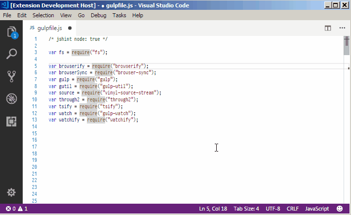

# Sort Lines by Selection

This extension allows you to sort lines based on the text selected in each line. It is a port of the [Sort Lines By Selection][1] plugin for Sublime Text 3.



The functionality is available via the Command Palette: Ctrl+Shift+P > Sort Lines by Selection.

## Natural Sort <a name="natural-sort"></a>

By default the extension compares selected strings lexicographically, which means that `10` will come before `9`. If you want numbers embedded in selected strings to be sorted as numbers, use Ctrl+Shift+P > Sort Lines by Selection (Natural Sort) command.

There is no all-in-one solution for which parts of a particular string should be treated as symbols and which as numbers. So the extension does not try to be super-smart and only supports the following:

- Whole numbers
- Fractional numbers with the decimal part separated with `.` (period)
- Negative numbers preceded with `-`

The following is _not_ supported:

- Hexadecimal numbers
- Numbers written in scientific format (`1e6`)

## Configuring Keybindings <a name="keybindings"></a>

The commands come without default keybindinds, but you can easily add them. Run Ctrl+Shift+P > Preferences: Open Keyboard Shortcuts (JSON) and paste something like this:

```json
{
  "key": "f10",
  "command": "sort-lines-by-selection.sortLinesBySelection"
}
```

The command takes optional arguments listed in the [section](#arguments) below.

To use [natural sort](#natural-sort), specify the `natural_sort` argument:

```json
{
  "key": "f10",
  "command": "sort-lines-by-selection.sortLinesBySelection",
  "natural_sort": true
}
```

You can change the `f10` key to anything you want. Also, keep in mind that all keybindings in the file must be separated with commas.

## Optional Command Arguments <a name="arguments"></a>

### `case_sensitive` (default: `false`)

Sorting is case-insensitive by default. To override, specify `"case_sensitive": true`:

```json
{
  "key": "f10",
  "command": "sort-lines-by-selection.sortLinesBySelection",
  "case_sensitive": true
}
```

### `natural_sort` (default: `false`)

Specify `"natural_sort": true` to use [natural sort](#natural-sort):

```json
{
  "key": "f10",
  "command": "sort-lines-by-selection.sortLinesBySelection",
  "natural_sort": true
}
```

### `morph`

A custom "morph" function can be applied to the selected strings before sorting. Please see the description of the [Sublime Text plugin][1] for more details. One difference is that for this extension the morph function has to be written in JavaScript rather than in Python.

By way of example, here is a command that sorts lines by their selected strings _reversed_:

```json
{
  "key": "shift+f10",
  "command": "sort-lines-by-selection.sortLinesBySelection",
  "args": {
    "morph": "s.split('').reverse().join()"
  }
}
```

Enjoy!

[1]: https://packagecontrol.io/packages/Sort%20Lines%20By%20Selection
